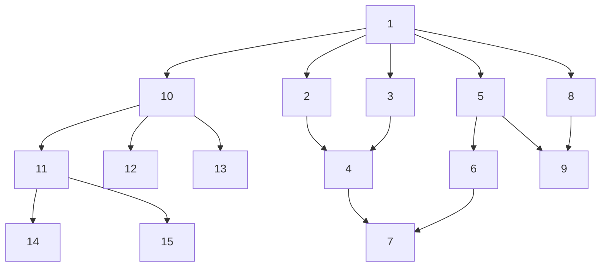

## Creating the following graph from a one-to-many mapping


To execute the binary:
```shell
cd examples/from_one_to_many_mapping
cargo run
```

The output:
```
descendants of 1 - [10, 2, 3, 5, 8, 11, 12, 13, 4, 6, 9, 14, 15, 7]
descendants of 10 - [11, 12, 13, 14, 15]
descendants of 3 - [4, 7]
```