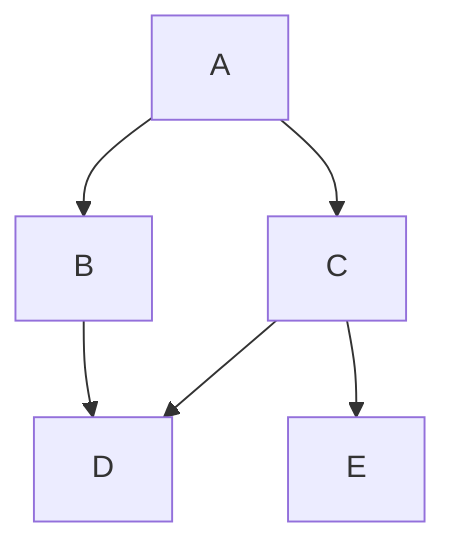

## Creating the following graph from a one-to-one mapping


To execute the binary:
```shell
cd examples/from_one_to_one_mapping
cargo run
```

The output:
```
Children of 'A' - Some(["B", "C"])
Children of 'C' - Some(["D", "E"])
Children of 'D' - Some([])
Children of a non existent node - None
level=1, node=A
level=2, node=B
level=2, node=C
level=3, node=D
level=3, node=E
```