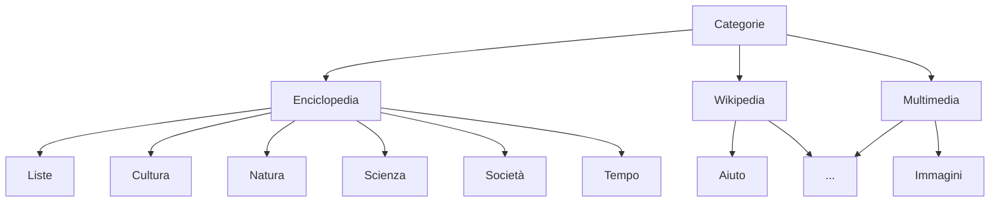
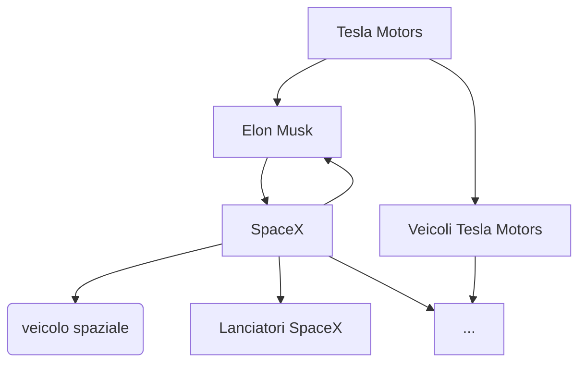

# Exploring Wikipedia's [Category Tree](https://en.wikipedia.org/wiki/Special:CategoryTree)


In this  example we're gonna explore Wikipedia's category tree which has over 460k nodes and more than a million relationships.

The categories are from the Italian Wikipedia, this is how the  top of the tree looks like:


In reality this is  a DAG because there are nodes that have multiple parents.  
And there are also many cyclic loops (but this isnt an issue as we keep track of nodes already seen).
For example:



To execute the binary:
```shell
cd examples/wikipedia_category_tree
cargo run
```

The output:
```
Number of descendants of 'Categorie' - 446244
Number of levels from 'Categorie' - 14
Descendants of 'Imperatori romani' - [
    "Usurpatori_romani",
    "Famiglie_imperiali_romane",
    "Ritratti_imperiali_romani",
    "Consorti_degli_imperatori_romani",
    "Auguste_romane",
    "Imperatori_delle_Gallie",
    "Tyranni_triginta",
    "Dinastia_costantiniana",
    "Dinastia_severiana",
    "Dinastia_flavia",
    "Dinastia_antoniniana",
    "Dinastia_teodosiana",
    "Dinastia_valentiniana",
    "Dinastia_giulio-claudia",
    "Livia_Drusilla",
]
Descendants of 'Letteratura' - 22993
Descendants of 'Letteratura_italiana' - 3002
Descendants of 'Letteratura_latina' - 1081
Descendants of 'Letteratura_latina', 'Letteratura_italiana', and 'Imperatori_romani' - 4077
```